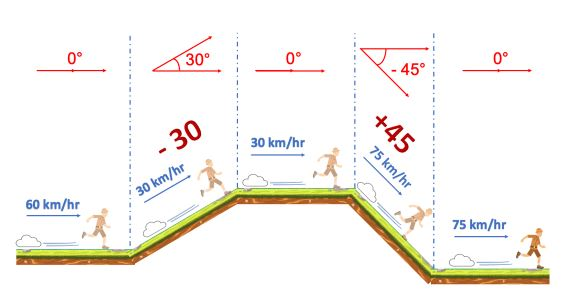

# Java Problems

## Game Platform

A gaming company is working on a platformer game. They need a method that will compute the charater's final speed, 
given a map and a starting speed.

The terrain on which the game charater moves forward is made from various pieces of land placed together. Implement 
the method `calculateFinalSpeed` which takes the initial speed of the character and an array of degress of 
inclination that represent the uneven terrain.

The speed of the character will increase or decrease proportionally to the inclination of the land as shown in the 
image below.



The magnitude of the angle of inclination will always be less than 90. The speed change occurs only once for each 
piece of land. The method should immediately return 0 as the final speed if an incline reduces the speed 0 or below 
0, which makes the character lose 1 life.

For example, the below code should print `75`

```java
System.out.println(calculateFinalSpeed(60.0, new int[]{0, 30, 0, -45, 0}));
```

## Mega Store

A megastore offers three types of discounts, which are represented as `DiscountType` enum.

Implement the `getDiscountedPrice` method which should take the total weight of the shopping cart, the total price 
and the discount type. It should return the final discounted price based on the discount schemes as shown in the 
description below.

- `Standard` discount for any weight is 6%
- `Seasonal` discount for any weight is 12%
- `Weight` discount is 6% if weight less than or equal to 10, otherwise 18%

For example, the following 

```java
System.out.println(getDiscountedPrice(12, 100, DiscountType.Weight)); // 82
```

## Boat Movements
